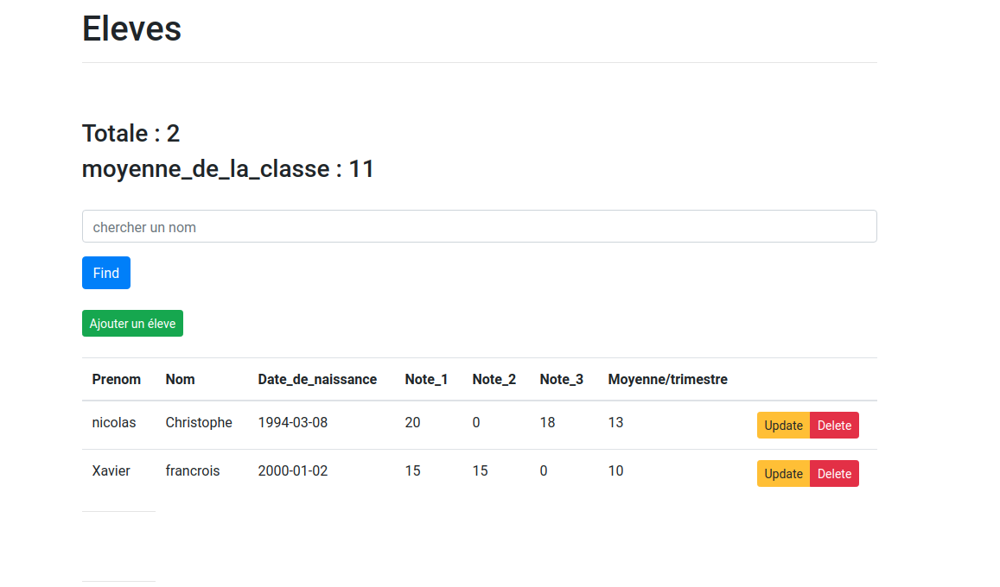

# TestRivalis

## APP Description :

The following project is basic CRUD app with Vue and Sanic.

we created a Vue application with the Vue CLI and then move on to performing the basic CRUD operations through a back-end RESTful API by Sanic.


## to use this project:

Run the server-side Flask app in one terminal window:

```
$ cd server
$ python3.7 -m venv env
$ source env/bin/activate
(env)$ pip install -r requirements.txt
(env)$ python app.py
```

Navigate to http://localhost:5000

Run the client-side Vue app in a different terminal window:

```
$ cd client
$ npm install
$ npm run serve
```

Navigate to http://localhost:8080


# Final app:





